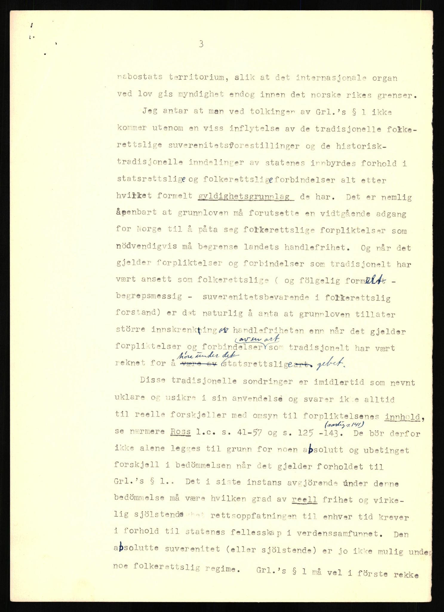

# avai_kasus

Denne oppgaven går ut på å trekke tekst ut av et bilde og så bruke NLP-teknikker på det man får ut. Fork dette repoet til din konto, og fyll ut med en løsning i notebook-en `avai_case.ipynb`. `requirements.txt` peker til pakker som trengs for å utføre oppgaven.

## Del 1
Du finner bildet `db60044923000260.jpg` her i rotmappen. Dette er et noe eldre dokument, skrevet med skrivemaskin, og er ganske typisk for mye av dokumentene vi har:

Les dokumentbildet med OCR, og følg instruksjonene i notebook-en for å evaluere resultatet.

## Del 2
Denne delen er ganske åpen. Det gis en hjelperfunksjon til API-et til Digitalarkivet til å laste ned resten av dokumentbildene til kilden. Bruk dette sammen med OCR-lesefunksjonen du implenterte i Del 1 til å lage et tekstkorpus og/eller et bildedatasett. Se om du kommer på noe interessante metoder som kan brukes på dette materialet. Du kan bruke hva som helst av biblioteker og ferdige modeller.
